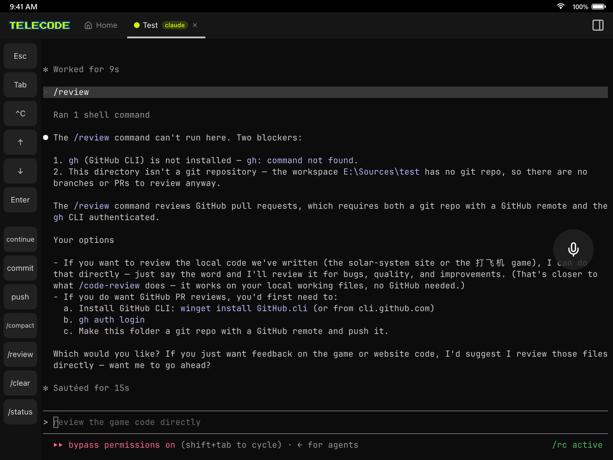

# TeleCode

A real terminal to your own computers — from your phone, tablet, browser, or another desktop.

You install a small host app on the machines you want to reach and sign in. After that, any device on the same account can open terminal sessions on them, and those sessions keep running on the host even when you disconnect, switch networks, or close the app entirely.

I built TeleCode because AI coding agents changed the shape of my day. The real work now happens in a terminal on my dev machine, often twenty minutes at a stretch, and I got tired of being chained to my desk while Claude Code chewed through a refactor. Now I start the agent at my desk and answer its questions from wherever I happen to be.

## What it does

- **Terminals that survive you.** Lose Wi-Fi, close the app, come back an hour later — the session is still there, exactly where it was. Run as many sessions across as many machines as your work needs, under one account.
- **Made for AI agents.** Start Claude Code (or Codex, Gemini, Copilot, Aider… the list keeps growing) in one tap. Get a push notification when an agent finishes or is waiting on you, even while the app is closed. Quick-key bars for the things you type constantly.
- **Voice input.** Dictate prompts instead of thumb-typing them. Surprisingly good for driving an agent from the couch.
- **A file browser that renders things.** Preview the web page your agent just built (JavaScript runs), read rendered Markdown and PDFs, view images and highlighted source, upload and download — without leaving the app.
- **Workspaces.** Per-project working directory, environment variables, and a startup command. Secrets are stored on your own host machine and never touch our servers.
- **Private by construction.** Connections go peer-to-peer when the network allows it, with an encrypted relay as fallback, and every connection is end-to-end encrypted (Noise protocol). The relay only ever sees ciphertext.

## Get it

**Desktop (host + client)** — install this on the computer you want to reach:

| Platform | Download |
|---|---|
| Windows 10/11 · x64 | [TeleCode-Setup.exe](https://dl.telecode.cc/win/TeleCode-Setup.exe) |
| macOS 13+ · Apple Silicon | [TeleCode.dmg](https://dl.telecode.cc/mac/TeleCode.dmg) |
| Ubuntu / Debian | `curl -fsSL https://dl.telecode.cc/install.sh \| sh` |

> **A note on Windows:** the installer isn't code-signed yet (signing certificates are unreasonably hostile to individual developers), so SmartScreen may show *"Windows protected your PC"* on first run. Click **More info → Run anyway** — the download is served from our own CDN and the SHA-256 is listed on each [release](../../releases). A `winget` package is [under review](https://github.com/microsoft/winget-pkgs/pull/407305); once it lands, `winget install TeleCode.TeleCode` will be the cleanest way in.

**Phone / tablet:** the iOS and Android apps are in store review and should be up shortly. Until then, the web client works on mobile too.

**Browser:** the [web client](https://www.telecode.cc/app.html) needs no install and has feature parity with the apps.

Signing up is free — email plus a verification code, or Google / Apple / GitHub.

## Status

TeleCode is in beta, and beta accounts currently get everything unlocked. Things move quickly; release notes live on the [releases page](../../releases).

This repository is the release and feedback channel — downloads, changelogs, and [issues](../../issues). The source code isn't published here.

- Website: <https://www.telecode.cc>
- Privacy policy: <https://www.telecode.cc/privacy.html>
- Contact: <support@telecode.cc>
